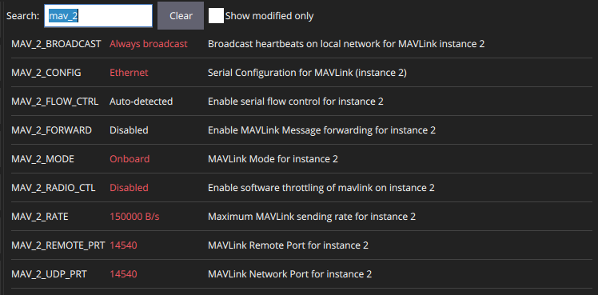

# PX4 Ethernet Configuration
Reference 1: See [here](https://docs.px4.io/main/en/advanced_config/ethernet_setup.html).
Reference 2: See [here](https://px4.io/get-the-pixhawk-raspberry-pi-cm4-baseboard-by-holybro-talking-with-px4/).

Some autopilots such as Pixhawk 6X have an ethernet port which can be used for high speec datalink with a companion computer.

## Autopilot port configuration
To configure an ethernet port on PX4 side, follow the following steps.
1. Connect the autopilot to QGroundControl using a USB cable
2. Configure the following PX4 parameters as in the following picture


## PX4 network configuration
* In QGC, click on the QGC icon (top left), choose `Analyze Tools`, then `MAVLink Console`
* Set the newtowrk parameters using the `nsh>` PX4 terminal command as follows
    ```bash
    nsh> echo DEVICE=eth0 > /fs/microsd/net.cfg
    nsh> echo BOOTPROTO=static >> /fs/microsd/net.cfg
    nsh> echo IPADDR=192.168.0.4 >> /fs/microsd/net.cfg
    nsh> echo NETMASK=255.255.255.0 >>/fs/microsd/net.cfg
    nsh> echo ROUTER=192.168.0.254 >>/fs/microsd/net.cfg
    nsh> echo DNS=192.168.0.254 >>/fs/microsd/net.cfg
    ```
*  Update the PX4 network settings using the command below (PX4 will reboot):
    ```
    nsh> netman update -i eth0
    ```
* Now you can connect your companion computer using the ethernet port on the autopilot. You will need to set a static IP of your wired network in Ubuntu.
* In your companion computer set stateic IP (e.g. `192.168.0.3`). Netmask `255.255.255.0`. Gateway `192.168.0.254`

* You can connect using MAVROS using the followin mavros laucnh arguments
    * `fcu_url` = `udp://:14540@192.168.0.4:14540`. 
    * `192.168.0.4` is PX4 IP, `14540` is the port you set in QGC.
    * 'gcs_url' = `udp://:14550@192.168.1.79:14550`
    * `192.168.1.79` is your PC IP over wifi, to get QGC connected (optional)
    * Make sure to use the right `tgt_system` for the MAVROS connection to work

# Stream Rate
To increase the IMU stream rate you can modify PX4 as follows.
* Use QGC `MAVLink Console` as mentioned above to access PX4 terminal.
* Navigate to the `/fs/microsd/etc`. If it does not exist, you can create it using `mkdir -p /fs/microsd/etc`
* If you want to increate the IMU rate on the TELEM2 link of Pixhawk 6X, execute the follwing in PX4 terminal
    ```bash
    echo "mavlink stream -d /dev/ttyS4 -s HIGHRES_IMU -r 150" > extras.txt
    ```
* If you want to increate the IMU rate on the ethernet link of Pixhawk 6X, execute the follwing in PX4 terminal
    ```bash
    echo "mavlink stream -u 14540 -s HIGHRES_IMU -r 200" > extras.txt
    ```
* Reboot the autopilot
* On your companion computer, you can check the IMU rate  (in ROS2), using
    ```bash
    ros2 topic hz /mavros/imu/data_raw
    ```